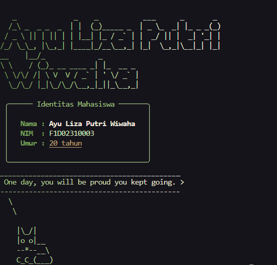

# T1-Node-Plugin

Tugas 1 untuk memenuhi mata kuliah pilihan Pemrograman Web Lanjut.

**Nama:** Ayu Liza Putri Wiwaha
**NIM:** F1D02310003

Program sederhana yang menampilkan identitas mahasiswa di terminal dengan tema warna matcha latte. Package yang dipakai:

- **chalk** untuk mewarnai nama, NIM, dan umur (bold, underline, warna hex)
- **cowsay** untuk menampilkan pesan motivasi dari karakter hewan lucu yang dipilih acak
- **figlet** untuk mengubah nama lengkap menjadi ASCII art
- **gradient-string** untuk efek warna gradasi
- **boxen** untuk membungkus identitas di dalam kotak
- **dayjs** untuk menghitung umur dari tanggal lahir

## Instalasi

Pastikan Node.js sudah terpasang, lalu jalankan:

```
npm install
```

## Menjalankan

Dengan data bawaan:

```
npm start
```

Dengan input sendiri, format `"Nama - NIM" "YYYY-MM-DD"`:

Tanggal lahir bersifat opsional. Kalau format tanggal salah, program tetap berjalan dan menampilkan keterangan format yang benar.

## Screenshot


